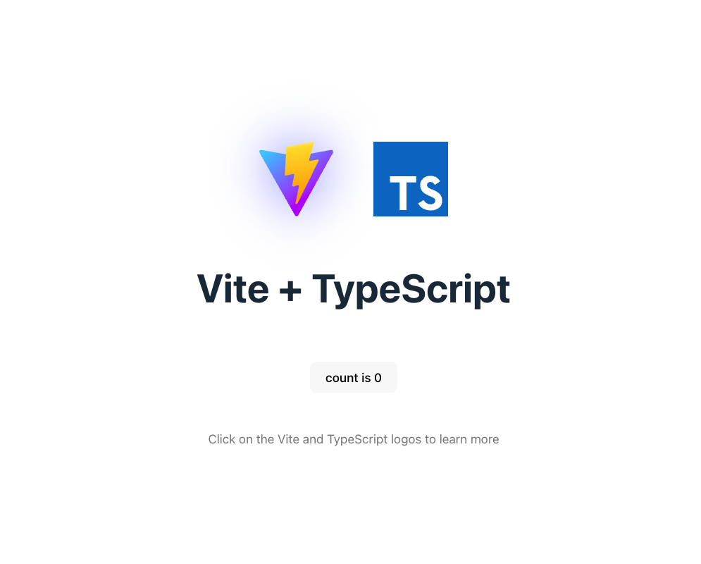
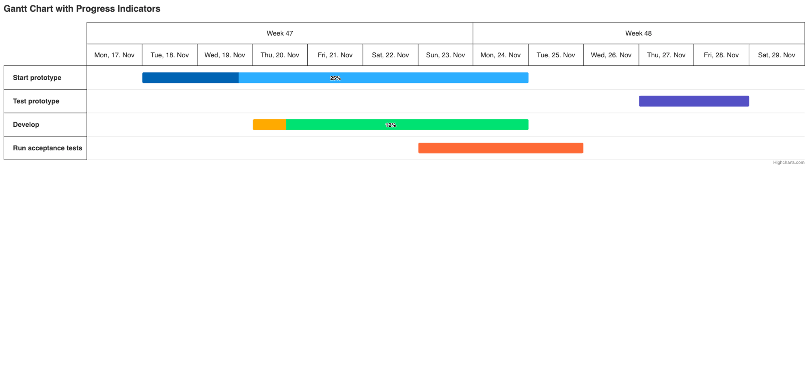
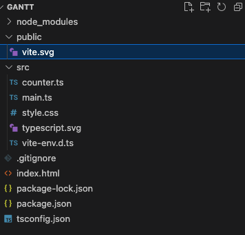
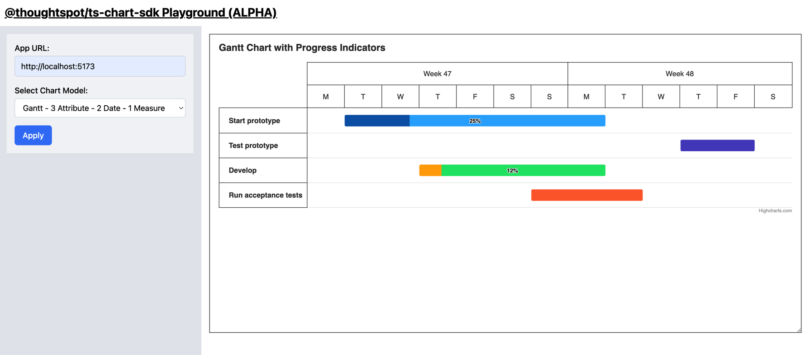

<p align="center">
    
</p>

<br/>

# ThoughtSpot Charts SDK <br/>

ThoughtSpot Charts SDK allows developers to integrate custom charts into ThoughtSpot. Developers can create custom charts in Javascript using charting libraries such as HighCharts and upload them to ThoughtSpot.

## Doc for custom chart examples

-   [Custom Map charts](./example/custom-bar-chart/README.md)
-   [Custom Bar Charts](./example/custom-bar-chart/README.md)

## ⚠️ Important Information ⚠️

### 🚀 Use `ts-chart-sdk` with TypeScript to enable static type checking.

### 📊 See [Custom Bar Chart](./example/custom-bar-chart/) example for the latest update.

---

# Get started

This tutorial demonstrates how to create a Gantt chart using HighCharts.
<insert links and fiddle links above>

-   [Highchart demo link](https://www.highcharts.com/demo/gantt/progress-indicator)
-   [JSFiddle link](https://jsfiddle.net/gh/get/library/pure/highcharts/highcharts/tree/master/samples/gantt/demo/progress-indicator)

## Prerequisites

Before you begin, check for the following requirements:

-   Access to a ThoughtSpot Cloud application instance
-   A Development Environment (IDE) for building custom charts
-   Working knowledge of JavaScript or Typescript
-   Familiarity with charting libraries such as Highcharts
-   Knowledge of the chart type

## Set up your environment

To create and test the application, this tutorial uses a Vite project setup.

### Create a new Vite project

1. Open a terminal window and run the following commands:

    ```bash
    md gantt
    cd gantt
    ```

2. Create a Vite project.
    ```bash
    $ npm create vite@latest
    ```
3. Configure the project name and development framework for your chart application. In this tutorial, we will use the Vanilla framework with TypeScript.

    ```bash
    ✔ Project name: … gantt demo
    ✔ Package name: … gantt-demo
    ✔ Select a framework: › Vanilla
    ✔ Select a variant: › TypeScript
    ```

4. Initialize your application.

    ```bash
    npm install
    npm run dev
    ```

5. Go to the localhost link and check if the following page shows up.

    

### Install Highcharts and lodash

```bash
npm install --save highcharts lodash
```

### Install the SDK

```bash
npm install --save @thoughtspot/ts-chart-sdk
```

## Render a chart on your local environment

Render a chart in the application created from the preceding steps.

This tutorial uses the [chart from the Highcharts library](https://www.highcharts.com/demo/gantt/progress-indicator) to create a custom Gantt chart.

### Implement the chart code

This tutorial uses the implementation code of the Gantt chart from the [Highcharts site](https://www.highcharts.com/demo/gantt/progress-indicator).

To implement the chart code in your application, complete these steps:

1. To copy the implementation code from the Highcharts library, select a chart type and click **Copy JS Code**.
2. Paste this code into the `main.ts` file in your `src` folder.
3. Import the dependencies for Highcharts and Highcharts Gantt module into your application code as shown in this example:

    ```bash
    import Highcharts from 'highcharts/es-modules/masters/highcharts.src';
    import 'highcharts/es-modules/masters/modules/gantt.src';
    ```

    Note the order of import.

4. Replace the content of `index.html` with the following snippet:

    Note that we have replaced the div id `app` with `container` because the code copied from Highcharts points to `container`.

    ```bash
    <!DOCTYPE html>
    <html lang="en">
      <head>
        <meta charset="UTF-8" />
        <meta name="viewport" content="width=device-width, initial-scale=1.0" />
        <title>Gantt Chart Demo</title>
      </head>
      <body>
        <div id="container"></div>
        <script type="module" src="/src/main.ts"></script>
      </body>
    </html>
    ```

5. Refresh the application URL and check if the chart imported into your application code is rendered:
   
6. Delete the unwanted files from your project folder
   The folder structure in your project at this point includes many files as shown in this figure.

    

    You can remove the following files.

    - `/public/vite.svg`
    - `/src/counter.ts`
    - `/src/typescript.svg`

## Integrate ThoughtSpot Chart SDK

The chart imported into your application has static data. To add ThoughtSpot capabilities such as drill, you need to fetch data from your ThoughtSpot application. To add ThoughtSpot capabilities and data to the chart code in your application, integrate ThoughtSpot Chart SDK and complete these steps:

1. [Initialize the Chart Context](#initialize-the-chart-context)
2. [Create a data model from input data](#Create-a-data-model-from-input-data)
3. [Plug data into the Highcharts datasets](#plug-data-into-the-highcharts-datasets)

### Initialize the Chart Context

Chart Context is the main context object that helps in orchestrating ThoughtSpot APIs to render charts. It also acts as a core central point of all interactions on the charts.

To initialize the chart context, call `getChartContext`:

```jsx
const init = async () => {
    const ctx = await getChartContext({
        getDefaultChartConfig: (chartModel: ChartModel): ChartConfig[] => {
            const columns = chartModel.columns;

            // Here we assume that the columns are always coming in the
            // following order.
            // [Project Name, Task, Start Date, End Date, Completion]

            // TBD: do basic validation here to ensure that the chart is renderable
            if (columns.length < 4) {
                // not possible to plot a chart
                return [];
            }

            const chartConfig: ChartConfig = {
                key: 'default',
                dimensions: [
                    {
                        key: 'project-name',
                        columns: [columns[0]],
                    },
                    {
                        key: 'task',
                        columns: [columns[1]],
                    },
                    {
                        key: 'start-date',
                        columns: [columns[2]],
                    },
                    {
                        key: 'end-date',
                        columns: [columns[3]],
                    },
                    {
                        key: 'completion',
                        columns: columns[4] ? [columns[4]] : [],
                    },
                ],
            };
            return [chartConfig];
        },
        getQueriesFromChartConfig: (
            chartConfig: ChartConfig[],
        ): Array<Query> => {
            // map all the columns in the config to the query array
            return chartConfig.map(
                (config: ChartConfig): Query =>
                    _.reduce(
                        config.dimensions,
                        (acc: Query, dimension) => ({
                            queryColumns: [
                                ...acc.queryColumns,
                                ...dimension.columns,
                            ],
                        }),
                        {
                            queryColumns: [],
                        } as Query,
                    ),
            );
        },
        renderChart: (context) => {},
    });
};

init();
```

> NOTE:
> For more information about the chart context component, refer to the following documentation resources:
>
> -   [https://ts-chart-sdk-docs.vercel.app/types/CustomChartContextProps.html](https://ts-chart-sdk-docs.vercel.app/types/CustomChartContextProps.html)
> -   [https://github.com/thoughtspot/ts-chart-sdk/blob/main/src/main/custom-chart-context.ts#L40](https://github.com/thoughtspot/ts-chart-sdk/blob/main/src/main/custom-chart-context.ts#L40)

The custom chart context component must include the following mandatory properties to function:

-   [`getDefaultChartConfig (Doc)`](<#getDefaultChartConfig-(Doc)>)
-   [`getQueriesFromChartConfig (Doc)`](<#getQueriesFromChartConfig-(Doc)>)
-   [`renderChart (Doc)`](<#getQueriesFromChartConfig-(Doc)>)

#### getDefaultChartConfig (Doc)

This function takes in a [ChartModel](https://ts-chart-sdk-docs.vercel.app/interfaces/ChartModel.html) object and returns a well-formed point configuration definition.

The point for the Gantt chart used in this tutorial looks like this:

```bash
// Project 1 - Project Name
{
    name: 'Start prototype',  // Task
    start: Date.UTC(2014, 10, 18), // Start Date
    end: Date.UTC(2014, 10, 25), // End Date
    completed: {
        amount: 0.25, // Completion
    },
}
```

The above data can be represented as a table in CSV format as shown here:

```bash
Project Name, Task, Start Date, End Date, Completion
"Project 1", "Start prototype", "2014-10-18", "2014-10-25", 0.25
```

To create a Highcharts version of the data set, the above-mentioned headers must be presented as columns from ThoughtSpot. The query on the ThoughtSpot Answer page should have all the above columns to plot a Gantt chart.

Ensure that the `getDefaultChartConfig` method is included in chartContext to define the configuration of the columns that are required to map the dataset into the chart. We assume that the order of the column is maintained in the chartModel.

To render the chart, the default configuration is required.

```jsx
getDefaultChartConfig: (chartModel: ChartModel): ChartConfig[] => {
    const columns = chartModel.columns;

    // Here we assume that the columns are always coming in the
    // following order.
    // [Project Name, Task, Start Date, End Date, Completion]

    // TBD: do basic validation here to ensure that the chart is renderable
    if (columns.length < 4) {
        // not possible to plot a chart
        return [];
    }

    const chartConfig: ChartConfig = {
        key: 'default',
        dimensions: [
            {
                key: 'project-name',
                columns: [columns[0]],
            },
            {
                key: 'task',
                columns: [columns[1]],
            },
            {
                key: 'start-date',
                columns: [columns[2]],
            },
            {
                key: 'end-date',
                columns: [columns[3]],
            },
            {
                key: 'completion',
                columns: columns[4] ? [columns[4]] : [],
            },
        ],
    };
    return [chartConfig];
},
```

<!--
> There is a better way to be able to configure the dimensions and columns in dimensions. But that is relatively a more advanced topic and not required for this demo. You can use the link below to look into the details of the same.
>

[TBD: Link to the Custom Chart Configuration Definition]
-->

#### getQueriesFromChartConfig (Doc)

This method defines the data query that is required to fetch the data from ThoughtSpot to render the chart. For most use cases, you do not require the data outside of the columns listed in your chart.

This example maps all the columns in the configuration as an array of columns in the arguments.

```jsx
getQueriesFromChartConfig: (
    chartConfig: ChartConfig[],
): Array<Query> => {
    // map all the columns in the config to the query array
    return chartConfig.map(
        (config: ChartConfig): Query =>
            _.reduce(
                config.dimensions,
                (acc: Query, dimension) => ({
                    queryColumns: [
                        ...acc.queryColumns,
                        ...dimension.columns,
                    ],
                }),
                {
                    queryColumns: [],
                } as Query,
            ),
    );
},
```

#### renderChart (Doc)

This `renderChart (Doc)` function is required to render the chart implemented in your code. This function ensures that every time `chartContext` tries to re-render the chart due to the changes in data or chart model, the chart rendered in your application is updated.

> **Note**:
> You can control render and re-render by implementing more granular control for the updates on data, visual props, or chart model.
>
> But we haven't yet implemented this. So let's proceed and implement this.

#### Implement the renderChart function

To implement renderChart, complete the following steps:

1. Create a function and move all the Highchart code inside the `renderChart` function.

```jsx
const renderChart = (ctx) => {
    // THE CHART
    Highcharts.ganttChart('container', {
        //....
    } as any);
    return Promise.resolve();
};
```

2. Implement the `renderChart` function in `getChartContext` as shown in this example:

```jsx
...
 renderChart: (context) => renderChart(context),
...
```

At this point, you will notice that the chart is gone on the link.

3. Wait for the chart to connect to the TS application.
4. Open the console log and check if you see the following logs:

```jsx
[vite] connecting...
[vite] connected.
Chart Context: initialization start
```

5. Run your application and test the chart implementation in the Playground.

#### Run the chart in the Playground

To run the chart and test your implementation, you need a Playground.

1. Open the following link to test your implementation with predefined data sets:

[https://ts-chart-playground.vercel.app/](https://ts-chart-playground.vercel.app/)

> **NOTE**
>
> You can check out the playground code on the GitHub repository to your local environment and modify the data set to test your charts effectively.

2. Add the following details as shown in the following example:

-   App Url : `<your localhost url with port>`
-   Chart Model: `Gantt - 3 Attribute - 2 Date - 1 Measure`



In the next step, you need to bring your data into the chart.

## Create a Data Model from input data

The data model is unique to every chart. It defines how each point will be plotted on the chart.

For the Gantt chart, this tutorial uses the following format for data points:

```jsx
{
    name: 'Start prototype',  // Task
    start: Date.UTC(2014, 10, 18), // Start Date
    end: Date.UTC(2014, 10, 25), // End Date
    completed: {
        amount: 0.25, // Completion
    },
}
```

However, the data retrieved from the chart model includes an array of column types as shown in this example:

```jsx
// inside chart model
{
    ...
    "data": [
        {
            "data": [
                {
                    "columnId": "79344559-4c71-45c6-be33-450316eab54d",
                    "columnDataType": "CHAR",
                    "dataValue": [
                        "Project 1",
                        "Project 1",
                        "Project 1",
                        "Project 1",
                        "Project 2",
                        "Project 2",
                        "Project 2",
                        "Project 2"
                    ]
                },
                {
                    "columnId": "bce26c20-1335-4357-9d3f-b15a6a27237d",
                    "columnDataType": "CHAR",
                    "dataValue": [
                        "Start prototype",
                        "Test prototype",
                        "Develop",
                        "Run acceptance test",
                        "Start prototype",
                        "Test prototype",
                        "Develop",
                        "Run acceptance test"
                    ]
                },
                {
                    "columnId": "cdd0329d-9ae6-41d2-b036-aa565eb18bc9",
                    "columnDataType": "CHAR",
                    "dataValue": [
                        1413570600000,
                        1414348200000,
                        1413743400000,
                        1414002600000,
                        1413570600000,
                        1414348200000,
                        1413743400000,
                        1414002600000
                    ]
                },
                {
                    "columnId": "59a5893c-f487-46f6-ab08-8cd7672c283d",
                    "columnDataType": "CHAR",
                    "dataValue": [
                        1414175400000,
                        1414521000000,
                        1414175400000,
                        1414261800000,
                        1414175400000,
                        1414521000000,
                        1414175400000,
                        1414261800000
                    ]
                },
                {
                    "columnId": "69a5893c-f487-46f6-ab08-8cd7672c283d",
                    "columnDataType": "FLOAT",
                    "dataValue": [
                        0.25,
                        null,
                        null,
                        null,
                        0.4,
                        null,
                        null,
                        null
                    ]
                },
                {
                    "columnId": "79a5893c-f487-46f6-ab08-8cd7672c283d",
                    "columnDataType": "CHAR",
                    "dataValue": [
                        null,
                        "Develop",
                        "Start prototype",
                        "Test prototype",
                        null,
                        "Develop",
                        "Start prototype",
                        "Test prototype"
                    ]
                }
            ]
        }
    ],
		...
}
```

You can transform the above structure to the point and series format that Highcharts can understand and interpret. Use the following code snippet to create a data model and plug data values into the chart.

```jsx
const getDataModel = (chartModel: any) => {
    const dataArr = chartModel.data[0].data;

    // create point from data
    const points = dataArr[0].dataValue.map((_val: string, idx: number) => {
        return {
            id: `${dataArr[0].dataValue[idx]} ${dataArr[1].dataValue[idx]}`,
            parent: dataArr[0].dataValue[idx],
            name: dataArr[1].dataValue[idx],
            start: new Date(dataArr[2].dataValue[idx]).getTime(),
            end: new Date(dataArr[3].dataValue[idx]).getTime(),
            completed: {
                amount: dataArr[4].dataValue[idx],
            },
            dependency: `${dataArr[0].dataValue[idx]} ${dataArr[5].dataValue[idx]}`,
        };
    });

    // create projects from points & data
    const projects = _.uniq(dataArr[0].dataValue);
    const dataSeries = projects.map((project) => {
        const filteredPoints = points.filter(
            (point: any) => point.parent === project,
        );
        return {
            name: project,
            data: [
                ...filteredPoints,
                {
                    id: project,
                    name: project,
                },
            ],
        };
    });

    // get max and min date
    const maxDate = _.max([...dataArr[2].dataValue, ...dataArr[2].dataValue]);
    const minDate = _.min([...dataArr[2].dataValue, ...dataArr[2].dataValue]);

    return {
        dataSeries,
        maxDate,
        minDate,
    };
};
```

## Plug data into the Highcharts datasets

Use the data model created from the above function and plug the values into the Highchart configuration to render the chart.

1. Create a data model object.  
   In your `renderChart` code, add the following line:

    ```jsx
    const dataModel = getDataModel(chartModel);
    ```

2. Replace X Axis min and max values.

```jsx
xAxis: {
    min: dataModel.minDate,
    max: dataModel.maxDate,
},
```

3. Replace the series.

```jsx
series: dataModel.dataSeries,
```

The chart implemented in your code now shows up on the playground with the data values you just plugged in.

The following example shows the entire chart code for the Gantt chart implementation described in this tutorial:

```jsx
/* eslint-disable simple-import-sort/imports */
import {
    ChartConfig,
    ChartModel,
    ColumnType,
    Query,
    getChartContext,
} from '@thoughtspot/ts-chart-sdk';
import Highcharts from 'highcharts/es-modules/masters/highcharts.src';
import 'highcharts/es-modules/masters/modules/gantt.src';
import _ from 'lodash';

const getDataModel = (chartModel: any) => {
    const dataArr = chartModel.data[0].data;

    // create point from data
    const points = dataArr[0].dataValue.map((_val: string, idx: number) => {
        return {
            id: `${dataArr[0].dataValue[idx]} ${dataArr[1].dataValue[idx]}`,
            parent: dataArr[0].dataValue[idx],
            name: dataArr[1].dataValue[idx],
            start: new Date(dataArr[2].dataValue[idx]).getTime(),
            end: new Date(dataArr[3].dataValue[idx]).getTime(),
            completed: {
                amount: dataArr[4].dataValue[idx],
            },
            dependency: `${dataArr[0].dataValue[idx]} ${dataArr[5].dataValue[idx]}`,
        };
    });

    // create projects from points & data
    const projects = _.uniq(dataArr[0].dataValue);
    const dataSeries = projects.map((project) => {
        const filteredPoints = points.filter(
            (point: any) => point.parent === project,
        );
        return {
            name: project,
            data: [
                ...filteredPoints,
                {
                    id: project,
                    name: project,
                },
            ],
        };
    });

    // get max and min date
    const maxDate = _.max([...dataArr[2].dataValue, ...dataArr[2].dataValue]);
    const minDate = _.min([...dataArr[2].dataValue, ...dataArr[2].dataValue]);

    return {
        dataSeries,
        maxDate,
        minDate,
    };
};

const renderChart = (ctx: any) => {
    const chartModel = ctx.getChartModel();
    console.log('chartModel:', chartModel);
    console.log('data:', chartModel.data);

    const dataModel = getDataModel(chartModel);

    console.log('dataModel:', dataModel);

    // THE CHART
    Highcharts.ganttChart('container', {
        title: {
            text: 'Gantt Chart with Progress Indicators',
            align: 'left',
        },

        xAxis: {
            min: dataModel.minDate,
            max: dataModel.maxDate,
        },

        accessibility: {
            point: {
                descriptionFormat:
                    '{yCategory}. ' +
                    '{#if completed}Task {(multiply completed.amount 100):.1f}% completed. {/if}' +
                    'Start {x:%Y-%m-%d}, end {x2:%Y-%m-%d}.',
            },
        },

        lang: {
            accessibility: {
                axis: {
                    xAxisDescriptionPlural:
                        'The chart has a two-part X axis showing time in both week numbers and days.',
                },
            },
        },

        series: dataModel.dataSeries,
    } as any);
    return Promise.resolve();
};

const init = async () => {
    const ctx = await getChartContext({
        getDefaultChartConfig: (chartModel: ChartModel): ChartConfig[] => {
            const columns = chartModel.columns;

            // Here we assume that the columns are always coming in the
            // following order.
            // [Project Name, Task, Start Date, End Date, Completion]

            // TBD: do basic validation here to ensure that the chart is renderable
            if (columns.length < 4) {
                // not possible to plot a chart
                return [];
            }

            const chartConfig: ChartConfig = {
                key: 'default',
                dimensions: [
                    {
                        key: 'project-name',
                        columns: [columns[0]],
                    },
                    {
                        key: 'task',
                        columns: [columns[1]],
                    },
                    {
                        key: 'start-date',
                        columns: [columns[2]],
                    },
                    {
                        key: 'end-date',
                        columns: [columns[3]],
                    },
                    {
                        key: 'completion',
                        columns: columns[4] ? [columns[4]] : [],
                    },
                ],
            };
            return [chartConfig];
        },
        getQueriesFromChartConfig: (
            chartConfig: ChartConfig[],
        ): Array<Query> => {
            // map all the columns in the config to the query array
            return chartConfig.map(
                (config: ChartConfig): Query =>
                    _.reduce(
                        config.dimensions,
                        (acc: Query, dimension) => ({
                            queryColumns: [
                                ...acc.queryColumns,
                                ...dimension.columns,
                            ],
                        }),
                        {
                            queryColumns: [],
                        } as Query,
                    ),
            );
        },
        renderChart: (context) => renderChart(context),
    });
};

init();
```

## Deploy your chart

If the chart creation is successful, you can host it on a server and make it available for use:

To deploy your charts, you can use Vercel, Netlify, or any server that can render an HTML page. For information, see <a href="https://vercel.com/docs/frameworks/vite" target="_blank">Vite documentation</a>.

To deploy the chart on a test domain in Vercel, install <a href="https://vercel.com/docs/cli" target="_blank">Vercel CLI</a> and run the following command:

```jsx
vercel;
```

For more information about Vercel deployment, see <a href="https://vercel.com/docs/getting-started-with-vercel" target="_blank">Vercel documentation</a>.

### Content Security Policy Overrides

To allow the use of Vercel application content in Thoughtspot, add the Vercel domain URL to the CSP allow-list. For more information, see the <a href="https://developers.thoughtspot.com/docs/?pageid=security-settings" target="_blank">Security settings section in ThoughtSpot documentation</a>.

## Useful URLs

### API references

-   Check out [ts-charts-sdk docs](https://ts-chart-sdk-docs.vercel.app/) to get API reference.

### Test framework

-   Open [Playground](https://ts-chart-playground.vercel.app/) to play with ts-chart-sdk with mock chartModel.

### Code Walkthrough

-   Play [demo](https://drive.google.com/drive/u/0/folders/1DbfiT1VP7j4SqhiCtM2JksTeIjbkI8h3) to get a viedo demo of code walkthrough and custom gantt-chart implementation.

## FAQ

#### How to save some chart specific state after client have made some changes in charts?

You can use `ChartToTSEvent.UpdateVisualProps` eventType inside `ctx.emitEvent()`. Since the payload type for this event is `unkown` you can just add a key value pair naming `clientState`.

**Sample** -

```js
ctx.emitEvent(ChartTOTSEvent.UpdateVisualProps,{
    visualProps:{
        clientState:"<req_state_in_string_format>"
        ...rest_of_visualProp
    }
})
```

-   NOTE: client State currently support only string data type. To use it with json object you can use `JSON.stringify(somelocalstate)`

#### Why my chart is getting re render in an infinte loop?

Probably you are implementing `update client state` logic inside the the `render` function of `getChartContext`. Since it `render` will be calling `update client state` logic and this logic might again cause `render` this will cause a cyclic call of `render`. Hence,it is advised not to implement it inside `render` function.

> NOTE:
> This can be called inside render function just that to avoid having an infinite loop clientState updates should be handled by chart developer properly.

#### How to add dynamic config for visualPorpEditorDefintion?

Since in our previous implementation of `visualPropEditorDefintion` we provided this as an static object of type `VisualPropEditorDefinition` but with the resent update this is converted function of type `VisualEditorDefinitonSetter` along with `VisualEditorDefintion`. So currently you can provide static config or dynamic config based on use case.

#### Only 1000 points are getting fetched for my query even though there are more results. How to increase that?

In `getQueriesFromChartConfig` along with `QueryColumn` you can provide additional optional key `queryParams`. In `queryParams` you can provide `size` to deal with the number of data points that need to fetched. Also there is hard limit of 100K data points to be fetched from the backend.

<br/>

ThoughtSpot Chart SDK, © ThoughtSpot, Inc. 2023
